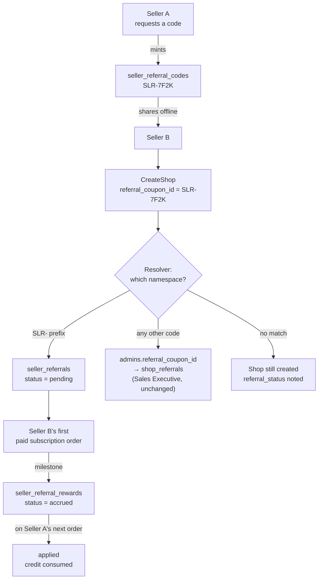
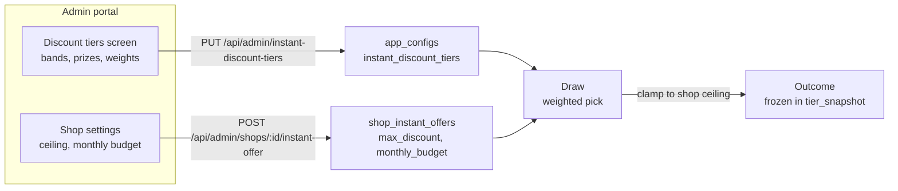
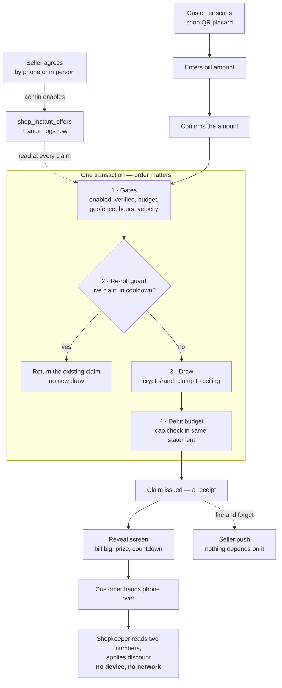
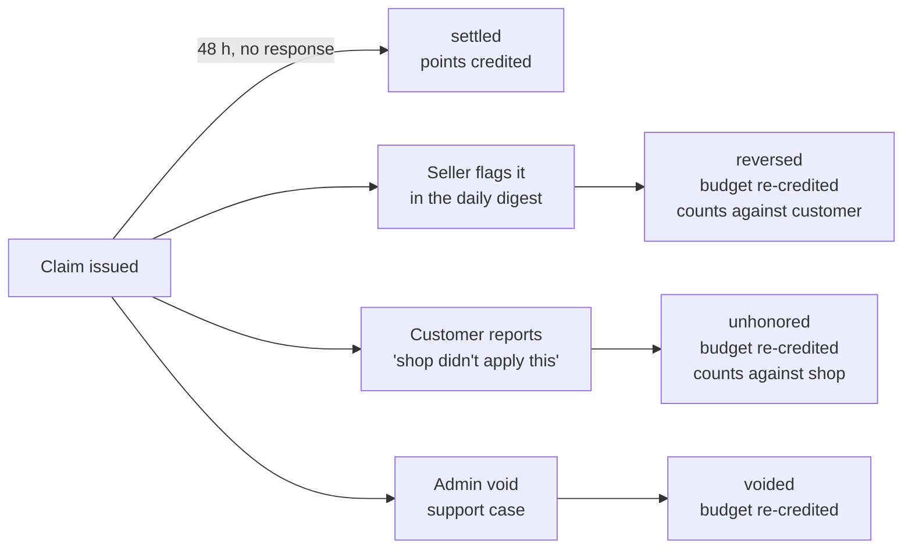

# Seller Referral & Instant Discount — Design and Build Spec

Status: **draft, pending sign-off on the open decisions in §7**
Target: `mandi-backend`
Migrations: `000045`, `000046`, `000047`

Two additive modules. Neither touches an existing table except `admins` (one
nullable column, already present) and the `CreateShop` referral resolver.

| Module | What it does | Firestore involved |
|---|---|---|
| A · Seller referral | A seller refers another seller and earns subscription credit when the referred shop starts paying | No |
| B · Instant discount | A customer at the counter scans the shop QR, enters their bill, and gets a seller-funded discount the seller confirms in-app | No |

---

## 0. Why these live in mandi-backend

Both write to data that already lives in this service's Postgres — `admins`,
`shops`, `subscription_orders`, `users`. Splitting either into its own service
would turn a single local transaction (confirm a claim, debit the budget, credit
points) into a distributed one. There is no independent scaling or ownership
argument to offset that.

Note for anyone extending this later: the Postgres `carts` / `shop_orders` /
`coupons` / `wallets` stack is inherited ecommerce-template code and is **not a
live path** — `customer-web-app` never calls `/api/carts` or `/place-order`.
Do not build new pricing logic on top of it.

---

## 1. Module A — Seller referral

### 1.1 Relationship to the existing referral tables

`pkg/domain/referral.go` and migration `000020_shop_referrals` already model a
*different* relationship: **Sales Executive → shop**. A platform user carries
`admins.referral_coupon_id`; a seller types it during onboarding; `shop_referrals`
attaches the shop to that executive for commission rollups.

Seller-refers-seller gets its own tables. `idx_shop_referrals_shop_id` permits
exactly one attachment per shop, so reusing it would make the two programs
overwrite each other and corrupt the executive commission reports.

### 1.1a Flow



The resolver is the whole design: one onboarding field, two disjoint code
namespaces, and the existing Sales Executive path untouched on the right.

### 1.2 Schema — migration `000045_seller_referrals`

```sql
CREATE TABLE IF NOT EXISTS seller_referral_codes (
    id             VARCHAR(32)  PRIMARY KEY,
    owner_admin_id VARCHAR(32)  NOT NULL,
    code           VARCHAR(24)  NOT NULL,
    is_active      BOOLEAN      NOT NULL DEFAULT TRUE,
    created_at     TIMESTAMPTZ  NOT NULL DEFAULT NOW(),
    updated_at     TIMESTAMPTZ  NOT NULL DEFAULT NOW(),
    deleted_at     TIMESTAMPTZ  NULL
);

-- Codes are retired, never reused, so the uniqueness predicate skips deletes.
CREATE UNIQUE INDEX IF NOT EXISTS uidx_seller_referral_codes_code
    ON seller_referral_codes (code) WHERE deleted_at IS NULL;
CREATE UNIQUE INDEX IF NOT EXISTS uidx_seller_referral_codes_owner
    ON seller_referral_codes (owner_admin_id) WHERE deleted_at IS NULL;

CREATE TABLE IF NOT EXISTS seller_referrals (
    id                VARCHAR(32) PRIMARY KEY,
    code              VARCHAR(24) NOT NULL,
    referrer_admin_id VARCHAR(32) NOT NULL,
    referred_shop_id  VARCHAR(32) NOT NULL,
    referred_admin_id VARCHAR(32) NOT NULL,
    status            VARCHAR(20) NOT NULL DEFAULT 'pending',
    qualified_at      TIMESTAMPTZ NULL,
    created_at        TIMESTAMPTZ NOT NULL DEFAULT NOW(),
    updated_at        TIMESTAMPTZ NOT NULL DEFAULT NOW(),
    deleted_at        TIMESTAMPTZ NULL,

    CONSTRAINT chk_seller_referral_no_self
        CHECK (referrer_admin_id <> referred_admin_id),
    CONSTRAINT chk_seller_referral_status
        CHECK (status IN ('pending','qualified','rewarded','void'))
);

CREATE UNIQUE INDEX IF NOT EXISTS uidx_seller_referrals_referred_shop
    ON seller_referrals (referred_shop_id) WHERE deleted_at IS NULL;
CREATE INDEX IF NOT EXISTS idx_seller_referrals_referrer
    ON seller_referrals (referrer_admin_id, status);

CREATE TABLE IF NOT EXISTS seller_referral_rewards (
    id                          VARCHAR(32)  PRIMARY KEY,
    referral_id                 VARCHAR(32)  NOT NULL REFERENCES seller_referrals (id),
    referrer_admin_id           VARCHAR(32)  NOT NULL,
    reward_type                 VARCHAR(30)  NOT NULL DEFAULT 'subscription_credit',
    amount_amount_minor         BIGINT       NOT NULL DEFAULT 0,
    amount_currency             CHAR(3)      NOT NULL DEFAULT 'INR',
    status                      VARCHAR(20)  NOT NULL DEFAULT 'accrued',
    applied_to_subscription_order_id VARCHAR(32) NULL,
    idempotency_key             VARCHAR(120) NOT NULL,
    created_at                  TIMESTAMPTZ  NOT NULL DEFAULT NOW(),
    updated_at                  TIMESTAMPTZ  NOT NULL DEFAULT NOW(),

    CONSTRAINT chk_seller_referral_reward_status
        CHECK (status IN ('accrued','applied','void'))
);

CREATE UNIQUE INDEX IF NOT EXISTS uidx_seller_referral_rewards_idem
    ON seller_referral_rewards (idempotency_key);
CREATE INDEX IF NOT EXISTS idx_seller_referral_rewards_referrer
    ON seller_referral_rewards (referrer_admin_id, status);
```

New ID prefixes in `pkg/domain/id.go` — add to the const block **and** to
`allPrefixes`, which `id_test.go` checks for uniqueness and length:

```go
PrefixSellerReferralCode   IDPrefix = "srfc"
PrefixSellerReferral       IDPrefix = "srf"
PrefixSellerReferralReward IDPrefix = "srfr"
```

### 1.3 Three settled decisions

**One onboarding field, two code namespaces.** `CreateShop` already accepts
`referral_coupon_id` and resolves it via `attachShopReferral`
(`pkg/usecase/admin.go:1450`). Keep the single field rather than making sellers
choose which kind of code they hold. Seller codes are **generated, never chosen**,
with a fixed `SLR-` prefix so the two namespaces are disjoint:

```
resolve(code):
  if strings.HasPrefix(code, "SLR-") -> seller_referral_codes
  else                               -> admins.referral_coupon_id  (unchanged)
  no match -> same validation error as today
```

Keep the existing non-fatal posture: a bad referral code must never block shop
onboarding. `attachShopReferral` already returns a status string rather than an
error — mirror that.

**Reward is subscription credit, not cash.** Sellers already pay through
`subscription_plans` / `subscription_orders` with tax-inclusive `Money` and GST
in basis points. Crediting the referrer against their next subscription order
keeps the whole reward inside a ledger we own. Cash payout needs payout rails,
bank-detail KYC, TDS on referral income, and a failed-transfer support surface —
explicitly out of scope.

**Reward accrues on a milestone, not on signup.** Accruing at signup is farmable
with shell registrations. The trigger is the referred shop's **first paid
subscription order** — already a backend-authoritative event, and the moment the
referral actually produced revenue.

### 1.4 Hook points

| Step | Where | Change |
|---|---|---|
| Attach | `pkg/usecase/admin.go` · `CreateShop` → `attachShopReferral` | Add sibling `attachSellerReferral`; resolver picks by prefix |
| Qualify | `pkg/usecase/subscription_payment.go` · payment success | Find pending referral for shop → `qualified` + one reward row, key `qualify:{referral_id}` |
| Redeem | subscription order creation | Apply `accrued` rewards, mark `applied` with the order id |

### 1.5 Endpoints

```
GET  /api/seller/referral                     my code, share text, counts by status
GET  /api/seller/referral/rewards             accrued/applied ledger, paginated
GET  /api/admin/seller-referrals              PermCanManageMarketing
POST /api/admin/seller-referrals/:id/void     writes a reversing reward row; never deletes
```

---

## 2. Module B — Instant discount at the counter

### 2.0 The operating model

Two facts about how this actually runs shape everything below:

1. **Enablement is a conversation, not a signup.** A seller contacts Locazar and
   says they are willing to give a discount. Only then does an admin switch them
   on. There is **no seller self-serve opt-in flow** — this is a field/phone
   sales motion, which is also how merchant acquisition demonstrably works in
   tier-2/3 India.
2. **The discount is a random draw**, sized by the bill amount the customer
   enters — not a fixed percentage. The mechanic is a scratch card, familiar to
   every Indian smartphone user from Paytm, PhonePe and CRED.

### 2.1 Why there is no seller tap at the counter

An earlier revision had the seller accept or reject each claim from a push
notification while the customer waited. **That does not work in a tier-2/3
shop**, for structural reasons rather than fixable UX ones. It needed this chain
to complete in under a minute, every time:

> push delivered → seller notices → unlocks phone → opens app → reads → taps

| Reality | Effect on the chain |
|---|---|
| Xiaomi / Oppo / Vivo / Realme dominate the tier-2/3 handset base, all with aggressive battery optimisation layered on Android | FCM connections get killed; pushes silently never arrive |
| Xiaomi autostart is **off by default** — after a reboot the app receives nothing until manually opened | A seller who rebooted last week is unreachable and does not know it |
| Shop network is intermittent — concrete buildings, basement units | Push and API call both fail at the worst moment |
| One person runs a busy counter, often a helper rather than the owner whose phone has the app | Nobody is holding the right device |
| Merchant tools are adopted only when they fit the daily rhythm and reduce work | An extra app interaction *per transaction* is the wrong shape |
| A rejection lands socially, in person, in a town where both parties likely know each other | The seller avoids rejecting; the mechanism decays into rubber-stamping |

The last row kills it even if every technical problem were solved: a verification
step sellers feel pressured to always approve is **worse than none**, because it
produces confirmed-looking data nobody checked.

### 2.2 The reframe: the shopkeeper's eyes, not their thumb

The seller's tap existed to check that the claimed bill matched the real
purchase. But the shopkeeper is *already* looking at the customer's phone — that
is how the discount gets applied to the bill.

> **The customer's screen is the verification surface.** It states the bill
> amount and the drawn discount in large type. If the numbers do not match what
> the customer is buying, the shopkeeper refuses on the spot, exactly as with a
> paper coupon. Synchronous, no app, no push, no network.

The claim record changes meaning accordingly:

| Before | After |
|---|---|
| An **authorization request**, pending until the seller acts | A **receipt**, issued immediately and final unless disputed |

### 2.3 The flow

| # | Actor | Step |
|---|---|---|
| 1 | Customer | Scans the shop's QR placard at the counter |
| 2 | Backend | Returns "this shop is giving discounts today", or nothing |
| 3 | Customer | Enters the bill amount |
| 4 | Customer | **Confirms the amount** — "Claiming on ₹400, correct?" |
| 5 | Backend | Checks eligibility and presence, **draws the discount** (§2.5), debits budget, issues the claim |
| 6 | Customer | Scratch-card reveal: shop name, bill, discount won, payable, code, 15-min validity |
| 7 | Customer | Hands the phone to the shopkeeper |
| 8 | Seller | Reads two numbers, applies the discount, hands the phone back. **No device, no network, no app.** |
| 9 | Seller | Fire-and-forget push — information only, nothing depends on it |
| 10 | Seller | Next quiet moment: one-tap daily digest to confirm or flag (§2.9) |

**Step 4 is not ceremony.** The draw binds to the bill amount and the claim is
immutable, so a mistyped amount cannot be corrected afterwards without an admin
void. Confirming first removes that failure mode, and it gives the reveal in step
6 a deliberate beat, which is what makes a scratch card feel like one.

**Step 6 screen requirements** — load-bearing, not styling:

- **Bill amount in the largest type**, larger than the discount. The shopkeeper
  must not hunt for the number they are checking.
- **Shop name displayed**, so a claim from another shop cannot be passed off.
- **Live countdown and a moving element**, so a screenshot is visibly stale.
- **"Shopkeeper: slide to apply"** on the customer's own phone. Not an auth
  mechanism — the customer can slide it themselves — its job is to force the
  handover so the shopkeeper's eyes land on the amount. Record the timestamp; a
  claim never slid is a weak signal.

### 2.4 What already exists

| Piece | Location | State |
|---|---|---|
| Shop QR placard | `seller-app/lib/shared/widgets/bar_code.dart:563` — encodes `{shopDeepLinkBase}/{shopId}` | Built |
| Customer scanner | `locazar-customer-app/.../features/shop/qr/ShopQrScanScreen.kt` | Built |
| Push to seller | `SendPushNotification`, `owner_type: "seller"` | Built |
| Rich notification image | `pkg/service/notification/fcm_service.go:479` — `data["image_url"]` | Built |
| Deep-link router | `seller-app/lib/core/notifications/notification_route.dart` (allowlist) | Built |
| Shop coordinates | shop lat/long, already used for radius search | Built |
| Shop open hours | `shop_times.open_time` / `close_time` | Built |
| Admin shop routes | `/api/admin/shops/...` with `RequirePermission` | Built |
| Audit log | `audit_logs` — actor, action, entity, JSONB metadata | Built |
| Config store | `app_configs` — key/value plus a structured JSON blob | Built |
| SMS reach | `pkg/service/sms` · `TwoFactorSMSService` | Built |

The QR does not change. Placards already in shops keep working.

### 2.5 The discount draw

**Outcomes are a weighted set of round numbers, not a uniform random range.**
The tier table is platform-wide, stored in `app_configs` under
`instant_discount_tiers`:

```jsonc
{
  "tiers": [
    { "min_bill_minor": 10000, "max_bill_minor": 50000,
      "outcomes": [
        { "discount_minor":  500, "weight": 60 },   // ₹5
        { "discount_minor": 1000, "weight": 30 },   // ₹10
        { "discount_minor": 2500, "weight": 10 }    // ₹25
      ] },
    { "min_bill_minor": 50000, "max_bill_minor": 200000,
      "outcomes": [
        { "discount_minor": 2000, "weight": 55 },
        { "discount_minor": 4000, "weight": 35 },
        { "discount_minor": 7500, "weight": 10 }
      ] }
    // …
  ]
}
```

Four reasons for discrete weighted outcomes rather than `rand(min, max)`:

1. **Round numbers read like a prize.** "₹25 off" is a scratch card; "₹23 off" is
   a rounding error.
2. **Expected value is exactly computable**, which is the number you quote in the
   sales conversation. For tier 1 above:
   `(500×60 + 1000×30 + 2500×10) / 100 = 850` → **₹8.50 average per customer**.
3. **The tail is controllable.** Rare large wins drive the word-of-mouth without
   the budget risk of a uniform distribution.
4. **It restores part of the shopkeeper's check.** Randomness removed their
   ability to verify "10% of ₹400 = ₹40". A small fixed set of possible values is
   something they learn within a week, so an out-of-range number still looks
   wrong.

**Rules the implementation must hold:**

- The draw happens **server-side at issue, is persisted, and is never recomputed**.
  The client never rolls and never sends a discount.
- The chosen outcome and the full tier snapshot are stored on the claim, so a
  later config edit cannot rewrite what a past claim meant.
- **No re-rolling.** A repeat scan by the same customer at the same shop inside
  the cooldown returns the **existing claim verbatim**, not a new draw. Without
  this, a customer who draws ₹5 simply backs out and rescans until they hit ₹25 —
  which is the single most likely abuse of a random mechanic, and it needs no
  fraud sophistication at all.
- Use `crypto/rand`, not `math/rand`. A predictable seed makes the draw
  farmable.

### 2.6 Eligibility — admin-enabled after an offline agreement

There is no seller-facing opt-in. An admin enables a shop after the seller agrees
by phone or in person, recording what was agreed.

| Gate | Source | Rationale |
|---|---|---|
| **Enabled by an admin** | `shop_instant_offers.is_active` | The seller agreed offline; this is the record of it |
| Shop active and verified | `shops.shop_status`, `shop_verification_status` | Unverified shops must not issue branded discounts |
| Budget remaining | `monthly_budget - budget_spent` | The ceiling the seller agreed to |
| Bill within min/max | offer config | Blocks ₹5 farming and absurd entries |
| **Customer within geofence** | claim lat/long vs shop lat/long | A QR can be photographed and shared; a location cannot |
| Shop open right now | `shop_times` | A claim against a closed shop is a signal, not a sale |
| Velocity within cap | `discount_claims` count | Per customer/shop/day and per customer/day |
| No live claim in cooldown | `discount_claims` | Prevents re-roll fishing (§2.5) |

Geofence radius should be **generous — 250 m**. Indoor GPS in a tier-2 market
street is poor, and a false rejection at the counter costs far more than a
marginal false accept. It exists to stop claiming from home, not to measure
metres. If location permission is denied, issue anyway with
`presence_source = 'qr_only'` and let the digest surface it — blocking would
strand honest customers over an OS dialog.

**Record the agreement.** Enabling writes an `audit_logs` row
(`action: "instant_offer.enabled"`, `entity_type: "shop"`, metadata carrying the
agreed terms) alongside the config row. When a seller later says "I never agreed
to this", that row is the answer.

### 2.6a Admin portal — where the amounts are controlled

Every number that decides a discount is admin-editable. Nothing is hardcoded and
nothing is set by the seller.



**Two screens, two scopes:**

| Screen | Location | Controls | Scope |
|---|---|---|---|
| Discount tiers | `admin-portal/src/app/dashboard/instant-discounts` | Bill bands, prize values, weights | Platform-wide |
| Shop instant offer | shop detail page, or the same section | `is_active`, `max_discount`, `monthly_budget`, `min_bill`, `daily_claim_cap`, agreement note | One shop |

Both follow the existing pattern in
`admin-portal/src/components/dynamic-feature-flags-panel.tsx` — `@/lib/api`,
`useCanWrite` gating, shadcn table + dialog — so there is no new frontend
architecture to invent.

**Three requirements on the tiers screen specifically:**

1. **Show the computed expected value per band, live, as the admin edits.** EV is
   the number quoted to sellers ("about ₹8.50 a customer"), so it has to be
   visible where the weights are being set, not derived later on a spreadsheet.
   `EV = Σ(discount × weight) / Σ(weight)`.
2. **Validate that weights are positive and that bands do not overlap or leave a
   gap.** A bill amount that matches no band must be impossible, or the draw has
   no outcome set to pick from.
3. **Editing tiers never touches past claims.** Each claim stores
   `tier_snapshot`, so history keeps the terms it was issued under. Say this on
   the screen — an admin needs to know an edit is not retroactive.

Every write from either screen records an `audit_logs` row. Tier edits move real
money across every enabled shop at once, so `action: "instant_discount_tiers.updated"`
with the before/after in metadata is the minimum.

Both screens sit behind `RequirePermission(domain.PermCanManageMarketing)`.

### 2.6b Flow — issue path



Never draw before the gates and the re-roll guard pass — an outcome revealed to
someone who was not entitled to one cannot be un-revealed.

### 2.6c Flow — settlement path



Silence is the happy path. A seller who never opens the app costs the system
nothing — which is the whole reason this replaced accept/reject.

### 2.7 Schema — migration `000046_instant_discounts`

```sql
CREATE TABLE IF NOT EXISTS shop_instant_offers (
    id                          VARCHAR(32)  PRIMARY KEY,
    shop_id                     VARCHAR(32)  NOT NULL,
    is_active                   BOOLEAN      NOT NULL DEFAULT FALSE,

    -- Per-shop ceiling on any single draw. The tier table (app_configs) supplies
    -- the outcomes; this clamps them to what this seller agreed to.
    max_discount_amount_minor   BIGINT       NOT NULL DEFAULT 0,
    max_discount_currency       CHAR(3)      NOT NULL DEFAULT 'INR',
    min_bill_amount_minor       BIGINT       NOT NULL DEFAULT 0,
    min_bill_currency           CHAR(3)      NOT NULL DEFAULT 'INR',

    monthly_budget_amount_minor BIGINT       NOT NULL DEFAULT 0,
    monthly_budget_currency     CHAR(3)      NOT NULL DEFAULT 'INR',
    budget_spent_amount_minor   BIGINT       NOT NULL DEFAULT 0,
    budget_spent_currency       CHAR(3)      NOT NULL DEFAULT 'INR',
    budget_period_start         DATE         NOT NULL DEFAULT CURRENT_DATE,

    daily_claim_cap             INTEGER      NOT NULL DEFAULT 0,  -- 0 = unlimited

    -- Provenance of the offline agreement.
    enabled_by_admin_id         VARCHAR(32)  NULL,
    enabled_at                  TIMESTAMPTZ  NULL,
    agreement_note              TEXT         NOT NULL DEFAULT '',

    created_at                  TIMESTAMPTZ  NOT NULL DEFAULT NOW(),
    updated_at                  TIMESTAMPTZ  NOT NULL DEFAULT NOW(),
    deleted_at                  TIMESTAMPTZ  NULL
);

CREATE UNIQUE INDEX IF NOT EXISTS uidx_shop_instant_offers_shop
    ON shop_instant_offers (shop_id) WHERE deleted_at IS NULL;

CREATE TABLE IF NOT EXISTS discount_claims (
    id                      VARCHAR(32)  PRIMARY KEY,
    shop_id                 VARCHAR(32)  NOT NULL,
    user_id                 VARCHAR(32)  NOT NULL,
    claim_code              VARCHAR(8)   NOT NULL,

    bill_amount_minor       BIGINT       NOT NULL,
    bill_currency           CHAR(3)      NOT NULL DEFAULT 'INR',
    discount_amount_minor   BIGINT       NOT NULL,   -- the drawn outcome
    discount_currency       CHAR(3)      NOT NULL DEFAULT 'INR',
    payable_amount_minor    BIGINT       NOT NULL,
    payable_currency        CHAR(3)      NOT NULL DEFAULT 'INR',

    -- issued   : created and valid; the normal terminal state
    -- disputed : seller flagged it in the digest, inside the window
    -- reversed : dispute upheld; budget re-credited, points clawed back
    -- unhonored: customer reported the shop refused to apply it
    -- voided   : admin cancelled it (mistyped bill, support case)
    status                  VARCHAR(12)  NOT NULL DEFAULT 'issued',

    -- The draw, frozen. tier_snapshot holds the outcome set and weights in force
    -- at issue, so a later config edit cannot rewrite history.
    tier_snapshot           JSONB        NOT NULL,

    -- Proof of presence
    claim_lat               NUMERIC(9,6) NULL,
    claim_lng               NUMERIC(9,6) NULL,
    distance_m              INTEGER      NULL,
    presence_source         VARCHAR(16)  NOT NULL DEFAULT 'geo',  -- geo | qr_only
    applied_at              TIMESTAMPTZ  NULL,   -- "slide to apply" gesture
    device_fingerprint      VARCHAR(128) NULL,

    -- Dispute
    dispute_window_ends_at  TIMESTAMPTZ  NOT NULL,
    disputed_at             TIMESTAMPTZ  NULL,
    dispute_source          VARCHAR(10)  NULL,   -- seller | customer
    dispute_reason          VARCHAR(40)  NULL,
    resolved_at             TIMESTAMPTZ  NULL,

    points_settled_at       TIMESTAMPTZ  NULL,
    valid_until             TIMESTAMPTZ  NOT NULL,  -- 15 min; stops hoarding
    created_at              TIMESTAMPTZ  NOT NULL DEFAULT NOW(),

    CONSTRAINT chk_discount_claim_status
        CHECK (status IN ('issued','disputed','reversed','unhonored','voided')),
    CONSTRAINT chk_discount_claim_presence
        CHECK (presence_source IN ('geo','qr_only'))
);

-- Serves the re-roll guard and the velocity caps.
CREATE INDEX IF NOT EXISTS idx_discount_claims_user_shop_created
    ON discount_claims (user_id, shop_id, created_at DESC);
CREATE INDEX IF NOT EXISTS idx_discount_claims_shop_created
    ON discount_claims (shop_id, created_at DESC);
CREATE INDEX IF NOT EXISTS idx_discount_claims_user_created
    ON discount_claims (user_id, created_at DESC);
-- Drives the settlement sweep.
CREATE INDEX IF NOT EXISTS idx_discount_claims_settle
    ON discount_claims (dispute_window_ends_at)
    WHERE status = 'issued' AND points_settled_at IS NULL;
```

Note what is **gone**: no `pending`, no `discount_type`/`discount_value` (the
tier table supplies outcomes), no expiry that kills a claim.

New ID prefixes (`pkg/domain/id.go`, plus `allPrefixes`):

```go
PrefixShopInstantOffer IDPrefix = "sido"
PrefixDiscountClaim    IDPrefix = "dcl"
```

### 2.8 Issue-time transaction

One transaction, no second phase. Order matters: **guard the re-roll first, draw
second, debit third** — never draw before confirming the customer is entitled to
a draw.

```
1. load offer + tier table; run every gate in §2.6
2. re-roll guard: existing live claim for (user, shop) in cooldown? -> return it, stop
3. draw the outcome (crypto/rand), clamp to shop max_discount
4. debit the budget with the cap check in the same statement
5. insert the claim with the tier snapshot
```

```sql
-- Step 4. Debit and cap check are one statement; no read-modify-write.
UPDATE shop_instant_offers
   SET budget_spent_amount_minor = budget_spent_amount_minor + $1,
       updated_at = NOW()
 WHERE shop_id = $2
   AND is_active = TRUE
   AND budget_spent_amount_minor + $1 <= monthly_budget_amount_minor
RETURNING budget_spent_amount_minor;
```

Zero rows means the budget ran out between the scan and the submit — return
"offer no longer available" and issue nothing. Use the existing
`Transaction(func(trxRepo interfaces.X) error)` wrapper (see
`OrderUseCase.SaveOrder`), not a bare `*gorm.DB` transaction.

> **Do not copy the wallet pattern.** `pkg/repository/wallet.go:29` does
> `UPDATE wallets SET total_amount_amount_minor = $1` with the total computed in
> Go — a read-modify-write with no lock, so concurrent writes silently lose one.
> Budget and points both use the relative form above.

Reversal is the mirror: `budget_spent = budget_spent - $1` in the same
transaction as the status flip.

### 2.9 Deferred reconciliation — the daily digest

This replaces accept/reject. It moves the seller's involvement off the counter
into a quiet moment, and makes silence safe rather than fatal.

> *Yesterday: 12 discounts given · ₹340 total.*
> **[ Looks right ]** **[ Something's wrong ]**

- **Silence confirms.** No response inside the window and every claim settles
  clean. This is the key inversion from the old design, where silence killed the
  claim. A seller who never opens the app costs the system nothing.
- **The window is 48 hours** from issue, then the sweep credits points and the
  claim is final.
- **Delivery is not push-dependent.** The digest is a screen with a home badge.
  Push and SMS are prompts to look at it, never the channel it lives in — per
  §2.1, no part of this design may assume a push arrives.
- **Disputes should be rare by construction.** The shopkeeper already saw the
  amount at the counter; the digest catches the residue.

A flagged claim goes `disputed` → reviewed → `reversed`: budget re-credited,
points never credited, dispute counted against that customer. Three upheld
disputes in a rolling window blocks them from the programme.

### 2.10 The risk this introduces, and its counterweight

Removing the seller's gate creates a real asymmetry: **the shop can simply refuse
to honour a validly issued discount.** The customer holds a screen promising ₹25
off and gets nothing.

Counterweight, mirroring the dispute path: the claim screen carries a quiet
**"Shop didn't apply this"** action, live for 24 hours. A report sets
`status = 'unhonored'`, re-credits the shop's budget — they did not in fact spend
it — and counts against the shop. Three reports in a rolling window auto-suspends
them from the programme, with a notification saying why.

Both sides can flag a bad transaction after the fact; neither has to confront the
other at the counter. That symmetry is what the redesign is built around.

### 2.11 The seller notification — non-blocking

The push stays, but nothing hangs off it. It is a receipt, not a request.

1. **Push** — `SendPushNotification`, `owner_type: "seller"`, body carrying the
   numbers: `"₹25 discount given on a ₹400 bill at your shop"`. No buttons.
2. **Generic image** — no backend change. `fcm_service.go:479–490` already reads
   `data["image_url"]` and applies it to `Notification.ImageURL` for Android,
   APNS and Webpush. Host one banner asset, pass its URL in `Data`.
3. **Tap destination** — a read-only claim detail page with a "report a problem"
   link. Add `/instant-discount` to **both** `notificationAllowedRoutes` in
   `notification_route.dart` **and** the `routes:` table in `main.dart`; an
   unlisted route is deliberately treated as "no route" and falls back to the
   inquiry screen.

```go
Data: map[string]string{
    "route":     "/instant-discount",
    "claim_id":  claim.ID,
    "image_url": cfg.InstantDiscountBannerURL,
}
```

If it never arrives — routine on a Redmi with autostart off — nothing breaks.

### 2.12 Endpoints

```
# Customer
GET  /api/shops/:id/instant-offer                  is this shop giving discounts?    (step 2)
POST /api/discount-claims                          bill + location in; draw out       (step 5)
POST /api/discount-claims/:id/applied              records the slide gesture          (step 7)
POST /api/discount-claims/:id/report-unhonored     customer-side report               (§2.10)

# Seller
GET  /api/seller/discount-claims/digest            the daily digest                   (§2.9)
POST /api/seller/discount-claims/digest/confirm    "looks right", one tap
POST /api/discount-claims/:id/dispute              flag one claim

# Admin — enablement lives here, not in the seller app
GET  /api/admin/instant-discount-tiers             read the platform tier table
PUT  /api/admin/instant-discount-tiers             edit bands, prizes, weights
POST /api/admin/shops/:shop_id/instant-offer       enable after the offline agreement
PUT  /api/admin/shops/:shop_id/instant-offer       adjust ceiling / budget
DELETE /api/admin/shops/:shop_id/instant-offer     disable
GET  /api/admin/instant-offers                     who is enabled, spend to date
GET  /api/admin/discount-claims                    all claims, filterable
POST /api/admin/discount-claims/:id/void           support: cancel a mistyped claim
```

Admin routes sit under the existing `/api/admin` group with
`RequirePermission(domain.PermCanManageMarketing)` and write `audit_logs` rows.

`POST /api/discount-claims`:

```jsonc
// request
{
  "shop_id": "shp_…",
  "bill_amount_minor": 40000,
  "lat": 26.9124, "lng": 75.7873,
  "device_fingerprint": "…"
}

// 201 — issued, not pending
{
  "claim_id": "dcl_…",
  "claim_code": "K4M2QP",
  "shop_name": "Sharma General Store",
  "bill_amount":     { "amount_minor": 40000, "currency": "INR" },
  "discount_amount": { "amount_minor":  2500, "currency": "INR" },
  "payable_amount":  { "amount_minor": 37500, "currency": "INR" },
  "status": "issued",
  "valid_until": "2026-09-01T12:45:00Z",
  "reroll_of": null          // set when a repeat scan returned an existing claim
}
```

### 2.13 Settlement sweep

Hourly, following the `cmd/cloudfunctions/enquiry-autoreject` pattern — same
scheduler-over-HTTP shape, same `?dryRun=true` param. Selects on
`idx_discount_claims_settle`: still `issued`, past `dispute_window_ends_at`, not
yet settled. Credits points, stamps `points_settled_at`. Idempotent via the
unique ledger key, so a re-run is a no-op.

---

## 3. Module C — Customer points (migration `000047`)

Points are **earned per confirmed claim** and credited when the dispute window
closes clean — not at the counter. A two-day delay before points land matches
what customers already expect from cashback in other Indian apps, and it removes
the need to claw back points that were spent before a dispute arrived.

Points belong to `users.id` (prefix `usr_`) — the customer app authenticates via
`/api/auth/sign-up` and `/api/auth/sign-in/otp/send` against `users`, **not**
`mobile_users`, which serves admin-portal OTP.

```sql
CREATE TABLE IF NOT EXISTS customer_point_ledger (
    id              VARCHAR(32)  PRIMARY KEY,
    user_id         VARCHAR(32)  NOT NULL,
    delta_points    BIGINT       NOT NULL,          -- signed
    reason          VARCHAR(30)  NOT NULL,          -- earn_claim | reverse_claim | redeem | expire | adjust
    source_type     VARCHAR(30)  NOT NULL,
    source_id       VARCHAR(32)  NULL,
    idempotency_key VARCHAR(120) NOT NULL,
    balance_after   BIGINT       NOT NULL,
    created_at      TIMESTAMPTZ  NOT NULL DEFAULT NOW()
);

CREATE UNIQUE INDEX IF NOT EXISTS uidx_customer_point_ledger_idem
    ON customer_point_ledger (idempotency_key);
CREATE INDEX IF NOT EXISTS idx_customer_point_ledger_user
    ON customer_point_ledger (user_id, created_at DESC);

CREATE TABLE IF NOT EXISTS customer_point_accounts (
    id             VARCHAR(32) PRIMARY KEY,
    user_id        VARCHAR(32) NOT NULL,
    balance_points BIGINT      NOT NULL DEFAULT 0,
    updated_at     TIMESTAMPTZ NOT NULL DEFAULT NOW()
);

CREATE UNIQUE INDEX IF NOT EXISTS uidx_customer_point_accounts_user
    ON customer_point_accounts (user_id);
```

Rules:

- **The ledger is the source of truth.** Append-only: no UPDATE, no DELETE.
  `customer_point_accounts` is a read cache, always rebuildable by summing the
  ledger — that property is what makes it safe.
- **`idempotency_key` is `UNIQUE NOT NULL`.** Earn key: `earn_claim:{claim_id}`.
  A duplicate key is **success**, not an error — return the existing outcome.
- **Balance updates are relative and in-transaction**, guard in the same
  statement:
  ```sql
  UPDATE customer_point_accounts
     SET balance_points = balance_points + $1, updated_at = NOW()
   WHERE user_id = $2 AND balance_points + $1 >= 0
  RETURNING balance_points;
  ```
  Zero rows means insufficient balance; no window between checking and spending.

Earn/redeem rates, caps and expiry live in `app_configs` (already exists, already
exposed read-only at `/api/app-configs`). No new config table.

---

## 4. Trust model

The closest comparable flow is **FavePay**: scan the partner QR, enter the bill,
get up to 10% back. One structural difference drives this design:

- **FavePay is the payment rail.** The amount typed is the amount then paid
  through the app, so the number verifies itself.
- **Locazar has no payment leg.** The customer pays cash or UPI directly to the
  shop. The typed amount is an unverified self-report.

The previous revision closed that gap with a seller tap. §2.0 explains why that
tap cannot be relied on here. The gap is now closed by three weaker mechanisms
that are each robust in the environment, stacked:

1. **The shopkeeper's visual check at the counter** (§2.1) — synchronous, no
   device, no network. This does most of the work.
2. **Proof of presence** (§2.4) — geofence plus QR plus open-hours, which bounds
   claims to people actually standing in the shop.
3. **Deferred dispute** (§2.7, §2.8) — a cheap after-the-fact correction for both
   sides, with silence defaulting to confirmed.

None is as strong as a payment rail. Together, against a discount capped in the
tens of rupees and bounded by a monthly budget, they are proportionate.

**Randomness helps here more than it looks.** With a fixed percentage, inflating
the bill buys a guaranteed proportional gain — the incentive is linear and
obvious. With a weighted draw, inflating the bill buys only a *chance* at a
better outcome from the next tier, against a ceiling the seller set. The payoff
becomes uncertain and small while the risk of being caught by the shopkeeper
holding the phone stays exactly the same. That is a meaningfully worse trade for
anyone considering it.

### 4.1 Funding determines fraud exposure

| Funding | Incentives at the counter | Exposure |
|---|---|---|
| **Seller-funded** (assumed) | The seller's own money is being discounted, and the seller is looking at the number. They will not apply a discount against a bill that is not real. | Self-policing. Platform exposure is reputational only. |
| **Platform-funded** | The seller loses nothing by applying a discount against an inflated bill and gains a happy customer. The customer gains too. | Collusion — both parties want the same lie, and no counter-side check catches it. |

This asymmetry is why the design assumes seller-funded, matching the framing
"check if the seller is eligible to *give* the discount". It is also why points
stay **off the counter screen**: the shopkeeper should only ever be applying
their own money, a decision they can make in one second.

If platform funding enters the counter flow, the collusion vector opens and the
visual check stops being a control — §5 becomes mandatory rather than prudent.

---

## 5. Anti-abuse controls

With no synchronous gate, and a random payout, these carry the weight.

- **Re-roll guard (§2.5).** The most likely abuse of a random mechanic needs no
  sophistication: draw ₹5, back out, rescan for ₹25. A repeat scan inside the
  cooldown must return the **existing** claim, never a new draw.
- **Low ceiling per draw.** The top outcome is doing more anti-fraud work than
  any other control. Inflating a bill to reach a higher tier buys a *chance* at a
  slightly better prize, not a guaranteed one — randomness weakens the incentive
  to lie, and a low ceiling finishes the job.
- **Geofence** — 250 m, generous by design (§2.6). Stops claiming from home.
- **Velocity caps** — per customer/shop/day and per customer/day across shops.
- **`crypto/rand` for the draw.** A predictable seed makes outcomes farmable.
- **Device fingerprint on every claim** — surfaces one device farming many
  accounts before it needs acting on.
- **Budget caps** — the outer bound; whatever gets past everything else is still
  limited to what the seller agreed to spend.
- **Dispute counters both ways** — N upheld disputes blocks a customer; N
  unhonored reports suspends a shop.
- **Full audit trail** — claims are never deleted or edited; outcomes are
  appended, admin voids and enablements carry the admin id.

**Escalation levers, deliberately not in v1** — each adds counter friction, so
hold them until the data asks for one:

- A **counter code** printed on the placard that the customer must type, proving
  they can see it right now.
- Bill **bands** ("under ₹500 / ₹500–2000 / ₹2000+") instead of exact amounts —
  coarser, easier for a shopkeeper to eyeball, less precision worth lying about.
- **UPI-linked claims** — the customer pays through a UPI intent from the app, so
  the amount is verified by the rail. The FavePay model, and the only genuinely
  strong fix; a much larger build that changes payment behaviour, so roadmap
  rather than v1.

---

## 6. Rollout

| # | Phase | Ships | User-visible |
|---|---|---|---|
| 1 | Firestore rules fix (§8) | rules only | No |
| 2 | Seller referral, end to end | `000045`, resolver, seller + admin endpoints | Seller app |
| 3 | Admin enablement + tier table | `000046`, admin endpoints, `instant_discount_tiers` config | Internal only |
| 4 | Draw + claim issue + customer screens | claim endpoints, draw, geofence, reveal screen | The counter flow works |
| 5 | Digest, disputes, unhonored reports | digest endpoints, seller screens, SMS prompt | Both apps |
| 6 | Points on settled claims | `000047`, ledger, settlement sweep | Balance visible |
| 7 | Points redemption | redeem endpoints, caps | Customer app |

Phase 3 is internal-only, which suits the operating model: the first cohort is
whichever sellers the team has already spoken to, enabled by hand. Phase 4 is
shippable before phase 5 — claims issue and the counter flow works, with
reconciliation done manually from the admin portal for that first cohort. That is
the right way to learn the real dispute rate, and the real draw economics, before
building screens around a guess at either.

### 6.1 Wiring checklist per module

- `pkg/domain/` — structs + `IDPrefix` consts + `allPrefixes` entries
- `pkg/db/migrations/` — `.up.sql` and `.down.sql`
- `pkg/repository/` + `pkg/repository/interfaces/`
- `pkg/usecase/` + `pkg/usecase/interfaces/`
- `pkg/api/handler/` + `interfaces/` + `request/` + `response/`
- `pkg/api/routes/`
- `pkg/di/wire.go` → regenerate `wire_gen.go`
- Swagger annotations → regenerate `cmd/api/docs`

---

## 7. Open decisions

1. **Who funds the discount?** Assumed seller-funded (§4.1) — which the
   enablement conversation implies, since the seller is agreeing to give it.
   Confirm, because it is what makes the shopkeeper's visual check work at all:
   they check because it is their money.
2. **The tier table.** The outcome sets and weights in §2.5 are placeholders.
   What matters commercially is the **expected value per claim** — that is the
   number quoted in the sales conversation ("about ₹8.50 per customer, never more
   than ₹25, capped at ₹2,000/month"). Pick the EV first, derive the weights.
3. **Per-shop ceiling, or one platform-wide table for everyone?** Assumed a
   shared table with a per-shop clamp, so the sales conversation stays simple.
4. **Cooldown length for the re-roll guard.** Assumed 24 hours, aligned with the
   daily velocity cap.
5. **Dispute window length.** Assumed 48 hours. Longer delays points; shorter
   gives sellers less chance to look.
6. **Geofence radius.** Assumed 250 m, deliberately loose.
7. **Dispute and unhonored thresholds.** Assumed 3 in a rolling 30 days for both,
   pending real data.
8. **Digest delivery channel.** In-app plus SMS assumed. WhatsApp reaches
   tier-2/3 merchants better but needs a BSP integration — decide early, it
   affects the phase-5 build.
9. **Seller referral reward unit** — rupees off the next subscription order, or
   free days? Assumed rupees.
10. **Referral qualification milestone** — first paid subscription (assumed), or
    first settled discount claim?

---

## 8. Unrelated but blocking-adjacent: `firestore.rules`

`mandi-backend/firestore.rules` declares `match /enquiry/{…}` **twice** — line 6
requires `request.auth != null`, and line 53 re-opens the same path:

```
match /enquiry/{enquiryId} { allow read: if true; allow create, update: if true; allow delete: if false; }
```

Firestore grants access if **any** matching rule allows it, so line 53 wins and
every enquiry document is world-readable and world-writable without a login.
Independent of both modules here; fix it as phase 1.
